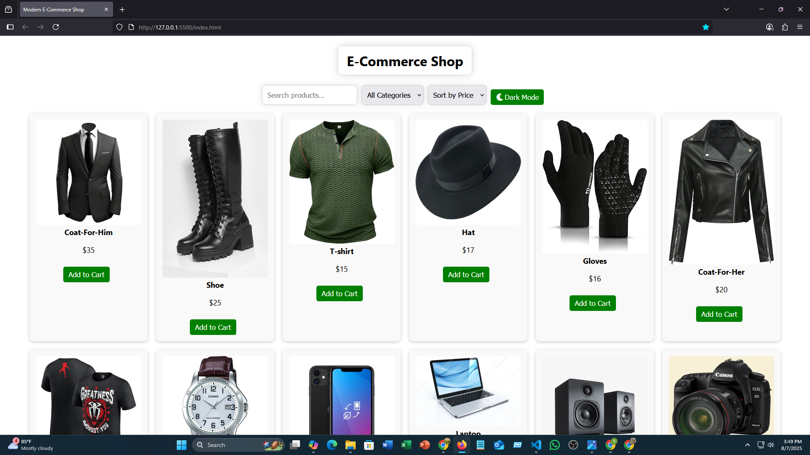

# professional-E-commerce-shop

## Project Description

This project is primarily built using HTML, CSS, and JavaScript. Compared to my other projects, I invested significantly more effort and time into developing this one. I encountered many challenges along the way, but instead of seeing them as obstacles, I treated each problem as a valuable learning opportunity and absorbed everything I could.

In this project, I have tried to incorporate several new features. While I received some guidance from MDN documentation and ChatGPT, I want to emphasize that I completed the entire project myself. Assistance was only sought in areas where I faced difficulties or made mistakes.

I strived to maintain a highly professional standard throughout the development process. Although there may still be room for improvement, I am committed to continuously enhancing my skills and delivering my best work.

Through overcoming the various challenges faced during this project, I have gained a much deeper understanding of JavaScript. I can now think more critically about it and implement practical solutions with confidence.

Moving forward, I plan to keep pushing my limits by learning new things and working on even bigger projects. I have aimed to be as truthful and transparent as possible in describing my journey.

If you wish, feel free to modify this project to improve it or to use it in your own work. I also welcome any constructive feedback or corrections if you notice any mistakes. This project is a reflection of my learning phase.

Thank you very much for taking the time to read my words.

---
## 🔗 Live Demo

If you'd like to see this project live in action, [**click here**](🔗 https://sameul-islam.github.io/professional-E-commerce-shop/) to explore it in your browser.

This project includes several modern features. You can zoom in on product images for a closer look, interact with various UI elements, and enjoy a clean and responsive design.

Take a moment to explore — there's a lot packed into this build.  
Thank you for checking it out!

## Screenshot

---
